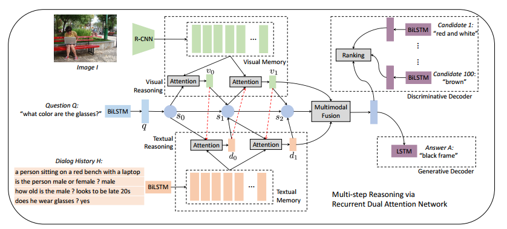

# Multi-step Reasoning via Recurrent Dual Attention for Visual Dialog

## 1. motivation： 

近些年来很火的方向：将 vision 和 natural language 结合起来。具体的应用有：

- image captioning
- visual question answering（VQA）
- visual dialog

VD 不像 VQA 只能回答一个单独问题。VD 可以回答关于某张图的一系列问题。关键是**如何理解image、如何记住 dialog history**

当前 Visual dialog 模型尽管已经取得了令人印象深刻的表现，但当问题涉及到图像的特定区域或者比较细节的对话片段时，模型就很难给出准确的答案

## 2. model

模型主要包括三个模块：

- Memory Generation：用RNN生成图像的向量、用BiLSTM生成历史问题的向量
- Muti-step Reasoning：使用循环双重注意力去联合编码问题、图像和对话历史，用于接下来的解码
- Answer Decoding：使用上一步得到的联合编码向量去推断答案

循环双重注意力其实做到了一个如下的流程：
$$
s_t \rightarrow v_t \rightarrow d_t \rightarrow s_{t+1}
$$
St 表示当前时刻问题的表示，我自己的理解是将t时刻的 St 作为一个query去检索文本和图像信息。

第一个attention：
$$
(s_t,d_{t-1}) \rightarrow v_t
$$
第二个attention：
$$
(s_t,v_t) \rightarrow d_t
$$
第三，更新St
$$
(v_t,d_t) \rightarrow s_{t+1}
$$
**MFB 方法暂时没有搞清楚，这一块略过。**

